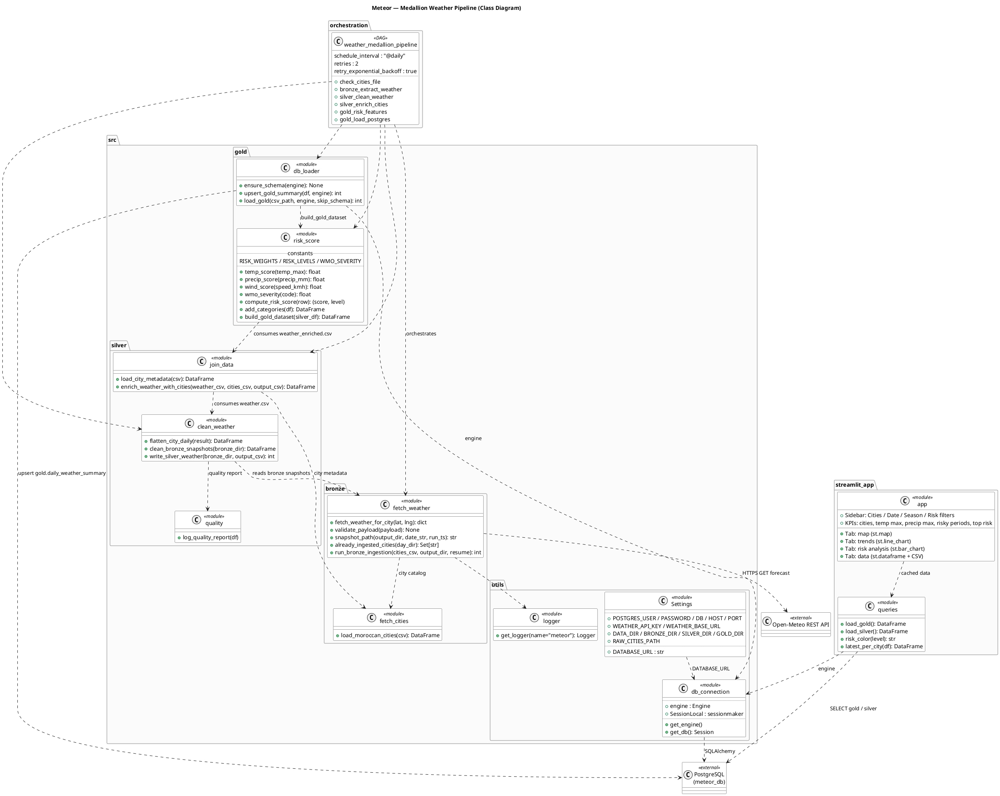

# 🌤️ Meteor — Weather Risk Pipeline & Dashboard

Meteor is an end-to-end weather intelligence pipeline for **Morocco**. It
fetches 7-day forecasts for **120+ cities** from the free
[Open-Meteo](https://open-meteo.com) API, cleans and enriches the data through a
**medallion architecture** (bronze → silver → gold), computes a **composite risk
score (0–100)** per city/day, stores the results in **PostgreSQL**, and exposes
them through an **Airflow**-orchestrated daily pipeline and a **Streamlit**
dashboard.

## Features

- 🌍 Forecast extraction for 120+ Moroccan cities (Open-Meteo REST API)
- 🧹 Medallion data pipeline: `bronze` (raw) → `silver` (clean) → `gold` (analytics)
- ⚠️ Weather risk scoring (heat, precipitation, wind, WMO severity) with
  LOW / MODERATE / HIGH / EXTREME levels
- ⏱️ Daily automation with **Apache Airflow** (retries + exponential backoff)
- 📊 **Streamlit dashboard**: KPIs, filters (city, date, season, risk level),
  risk map, trends, and a *"where and when to be vigilant"* banner
- 🧭 SQL business-analysis queries on the gold layer
- 🐳 Fully containerized with **Docker Compose** (Postgres + Airflow + Streamlit)

## Architecture

The pipeline follows a classic medallion (multi-hop) pattern:

| Layer | Input | Output | Code |
|---|---|---|---|
| **Bronze** | Open-Meteo API | Raw JSON snapshots (`data/bronze/<date>/`) | `src/bronze/` |
| **Silver** | Bronze snapshots | Cleaned, deduplicated + city-enriched CSV | `src/silver/` |
| **Gold** | Silver CSV | Risk features + summary | `src/gold/risk_score.py` |
| **DB** | Gold CSV | `gold.daily_weather_summary` (PostgreSQL) | `src/gold/db_loader.py` |
| **Orchestration** | Bronze → Gold | Daily DAG `weather_medallion_pipeline` | `dags/` |
| **Dashboard** | PostgreSQL | Streamlit app on `:8501` | `streamlit_app/` |



## Tech stack

- Python 3.12 · pandas · SQLAlchemy 2 · psycopg2-binary
- Apache Airflow 2.10 · Streamlit
- PostgreSQL 16 · Docker Compose
- PlantUML (diagrams)

## Repository layout

```
meteor/
├── dags/                  # Airflow DAG (weather_medallion_pipeline)
├── docker/                # Dockerfiles + per-service requirements
├── data/                  # Generated artifacts (gitignored)
│   ├── bronze/            #   raw API snapshots
│   ├── silver/            #   cleaned / enriched CSVs
│   └── gold/              #   gold summaries
├── docs/                  # Methodology docs (risk score)
├── sql/
│   ├── schema.sql         # Postgres schemas + tables (silver/gold)
│   ├── queries.sql        # 5 business-analysis queries
│   └── 00-create-airflow-db.sh
├── src/
│   ├── bronze/            # API ingestion
│   ├── silver/            # cleaning, quality, enrichment
│   ├── gold/              # risk features + DB loader
│   └── utils/             # config, DB connection, logging
├── streamlit_app/         # Dashboard (app.py, queries.py)
├── tests/                 # pytest suite
├── UML/                   # Project diagrams
└── docker-compose.yml
```

## Getting started

### Prerequisites

- Docker Engine 24+ with Docker Compose v2
- Free TCP ports: `5432` (Postgres), `8080` (Airflow), `8501` (Streamlit)

### 1. Configuration

```bash
cp .env.example .env
# edit credentials if needed (defaults are fine for local dev)
```

Key settings (`.env`):

| Variable | Default | Purpose |
|---|---|---|
| `POSTGRES_USER` / `POSTGRES_PASSWORD` / `POSTGRES_DB` | `postgres` / `postgres` / `meteor_db` | Application database |
| `AIRFLOW_DB` | `airflow_meta` | Dedicated Airflow metadata database |
| `AIRFLOW_USERNAME` / `AIRFLOW_PASSWORD` | `admin` / `admin` | Airflow web UI login |
| `AIRFLOW_UID` | `50000` | UID used inside the Airflow container |

### 2. Start the stack

```bash
docker compose up -d --build
```

On first boot, `sql/schema.sql` and `sql/00-create-airflow-db.sh` run inside the
Postgres container (creates `silver`/`gold` schemas **and** a dedicated
`airflow_meta` database so Airflow metadata never mixes with application data).

### 3. Services

| Service | URL | Credentials |
|---|---|---|
| Streamlit dashboard | http://localhost:8501 | — |
| Airflow web UI | http://localhost:8080 | `admin` / `admin` |
| PostgreSQL | `localhost:5432` | `postgres` / `postgres` |

### 4. Run the pipeline

**Automatic (recommended)** — the DAG `weather_medallion_pipeline` runs
`@daily`. Trigger it manually from the Airflow UI
(*DAGs → weather_medallion_pipeline → ▶ Trigger*).

**Manual / ad-hoc test**

```bash
docker exec meteor_airflow airflow dags test weather_medallion_pipeline $(date +%F)
```

**Layer by layer** (run from the repo root):

```bash
# bronze — fetch 7-day forecasts for all cities (≈ 3–4 min, rate-limited)
python -m src.bronze.fetch_weather --resume

# silver — clean snapshots, then enrich with city metadata
python -m src.silver.clean_weather
python -m src.silver.join_data

# gold — compute risk features, then upsert into PostgreSQL
python -m src.gold.risk_score
python -m src.gold.db_loader
```

The dashboard reads from PostgreSQL and auto-refreshes (10-min cache).

## Database schema

`sql/schema.sql` defines:

- `silver.weather` — cleaned daily forecast (one row per city per day)
- `gold.daily_weather_summary` — analytics-ready rows with risk categories and
  `risk_score` / `risk_level`

`airflow_meta` hosts the Airflow metadata tables (kept separate from `meteor_db`).

## Risk score methodology

The gold layer computes a composite score **0–100**:

```
risk_score = 0.30·temp + 0.30·precipitation + 0.20·wind + 0.20·WMO severity
```

Full formula, thresholds and rationale: [`docs/risk_score.md`](docs/risk_score.md).

## Business analysis queries

[`sql/queries.sql`](sql/queries.sql) provides 5 executable SQL analyses over the
gold layer (e.g. hottest cities, wettest cities, highest average risk, riskiest
periods, worst day per city with a window function).

## Testing

```bash
python -m venv .venv && source .venv/bin/activate
pip install -r requirements.txt -r docker/requirements-dev.txt
pytest
```

## Troubleshooting

- **Airflow fails to write snapshots (`Permission denied`)** — the bind-mounted
  `./data` volume is owned by your host user (uid 1000), while Airflow runs as
  uid 50000. Grant write access with:
  ```bash
  setfacl -R -m u:50000:rwx -m d:u:50000:rwx data
  ```
- **Bronze run is slow** — intentional: the API is rate-limited (≈1.2 s between
  cities → ~4 min for 120 cities). Use `--resume` to skip already-ingested cities.
- **Fresh database on an existing volume** — init scripts only run on the first
  volume creation; recreate the volume or re-run `docker exec -i meteor_db psql
  -U postgres -d meteor_db < sql/schema.sql`.